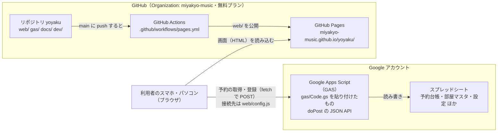

# 練習室予約システム 保守マニュアル ― はじめに

宮城教育大学 音楽棟の練習室予約システム（リポジトリ `miyakyo-music/yoyaku`）の保守マニュアルです。「りざぶ郎」の代わりとして作った、練習室を予約するための Web アプリについて、使い方・直し方・引き継ぎ方をまとめています。

- 予約表: https://miyakyo-music.github.io/yoyaku/
- 管理画面: https://miyakyo-music.github.io/yoyaku/admin.html
- 限定公開の部屋の入口: https://miyakyo-music.github.io/yoyaku/?limited
- プライバシーポリシー: https://miyakyo-music.github.io/yoyaku/privacy.html
- この文書を書いた時点の版: `v0.4.0-beta`（`web/api.js` の `APP_VERSION`）

## 目次と対象読者

| 文書 | 内容 | 主な読者 |
| :--- | :--- | :--- |
| [00_はじめに.md](00_はじめに.md) | 全体像・構成図・用語 | 全員 |
| [01_管理者向け操作マニュアル.md](01_管理者向け操作マニュアル.md) | 管理画面の各タブの使い方、管理者モード、限定公開、休館、お知らせ、不具合報告、スプレッドシートの見方 | 管理者（教員・事務・担当学生） |
| [02_利用者向けガイド.md](02_利用者向けガイド.md) | 予約・変更・取消、編集用パスワード、スマホでの操作 | 利用者（学生・教員）。掲示や配布にも使える |
| [03_保守・更新手順.md](03_保守・更新手順.md) | 画面とサーバーの直し方・公開のしかた、版の管理、元に戻す方法、開発環境 | システム担当者 |
| [04_データとバックアップ.md](04_データとバックアップ.md) | スプレッドシートの各シートと列、バックアップ、復元 | 管理者・システム担当者 |
| [05_引き継ぎ手順.md](05_引き継ぎ手順.md) | 担当者交代時のチェックリスト | 前任者・後任者・責任者の教員 |
| [06_トラブルシューティング.md](06_トラブルシューティング.md) | 画面に出るエラーの意味と対処 | 管理者・システム担当者 |

既存の文書（`docs/デプロイ手順.md`、`docs/運用・引き継ぎマニュアル.md`、リポジトリ直下の `README.md`）も参考になります。初めて GAS をデプロイする手順は `docs/デプロイ手順.md` に詳しく書いてあります。

## システムの構成

| 部分 | 置き場所 | 中身 | 更新のしかた |
| :--- | :--- | :--- | :--- |
| 画面 | GitHub Pages（リポジトリの `web/`） | `index.html`（予約表）、`admin.html`（管理画面）、`privacy.html`（プライバシーポリシー）、`api.js`（通信と版）、`config.js`（GAS の URL）、アイコン | `main` ブランチに push すると自動で公開（[03](03_保守・更新手順.md)） |
| サーバー | Google Apps Script（スプレッドシートに紐づく） | `gas/Code.gs`、`gas/appsscript.json` | Apps Script エディタに手作業で貼り付けて、「デプロイを管理」から新しいバージョンにする（[03](03_保守・更新手順.md)） |
| データ | Google スプレッドシート | 予約台帳・部屋マスタ・休館・利用停止・設定・操作ログ・不具合報告 | 管理画面から、またはシートを直接編集（[04](04_データとバックアップ.md)） |
| 秘密の情報 | GAS のスクリプトプロパティ、「設定」シート | 管理用パスワード（`ADMIN_PASSWORD`）、閲覧パスワード・限定公開の部屋のパスワード | 管理画面の「パスワード」タブ |
| 開発環境 | 担当者のパソコン | `dev/serve.py` ほか | `python3 dev/serve.py`（[03](03_保守・更新手順.md)） |

- 画面と GAS の接続先（ウェブアプリの URL）は `web/config.js` に書いてあります（公開済みの情報です）。
  - `https://script.google.com/macros/s/AKfycbwq8wtllGrITwNSLkfmBKNYXLwnh-LbF58fUbW1fYr_SLi4tArg2Irlp__zbOtUgQ/exec`
- 予約データ・パスワードはリポジトリには含まれていません（リポジトリは公開されていて誰でも見られます）。
- スプレッドシートの URL は管理画面の「データベース」ボタンから開けます（共有されている Google アカウントだけが開けます）。
- スプレッドシートの置き場所・持ち主: （要確認：共有ドライブ名と、GAS をデプロイしている Google アカウント）

## 費用

- GitHub: Organization `miyakyo-music` は無料（Free）プラン。リポジトリは公開（Public）で、GitHub Pages と GitHub Actions を使っています。
- Google: スプレッドシートと Google Apps Script のみ。
- サーバーの利用料・契約はありません。

## 用語

| 用語 | 意味 |
| :--- | :--- |
| GitHub | プログラムを保存・公開するサービス。変更の履歴がすべて残る |
| リポジトリ | GitHub 上のプログラムの置き場所（ここでは `miyakyo-music/yoyaku`） |
| `main` ブランチ | 本番に公開される版。ここに push すると、1〜2分で予約表に反映される |
| push | 手元で行った変更を GitHub に送ること |
| GitHub Actions | push をきっかけに自動で作業をする仕組み。ここでは `web/` を公開する |
| GitHub Pages | リポジトリのファイルをホームページとして公開する仕組み |
| GAS（Google Apps Script） | Google が提供する、スプレッドシートを読み書きするプログラムの実行環境 |
| デプロイ | GAS のプログラムを、画面から呼べる状態で公開すること |
| 管理用パスワード | 管理画面に入る・どの予約でも変更・取消できるパスワード（6文字以上） |
| 編集用パスワード | 利用者が予約ごとに付ける4桁の数字（任意） |
| 管理者モード | 同じタブで管理画面にログインしたまま予約表に戻った状態。どの予約も変更・取消できる |
| 限定公開 | パスワードを入れた人にだけ表示・予約できる部屋の設定（演習室など） |
| 版（バージョン） | `v0.4.0-beta` のような名前。`beta` が付いている間は「試験運用中」の帯が出る |
| タグ | 特定の時点の版に付けた名前（例: `v0.3.3-beta`）。いつでもその時点の内容を取り出せる |
